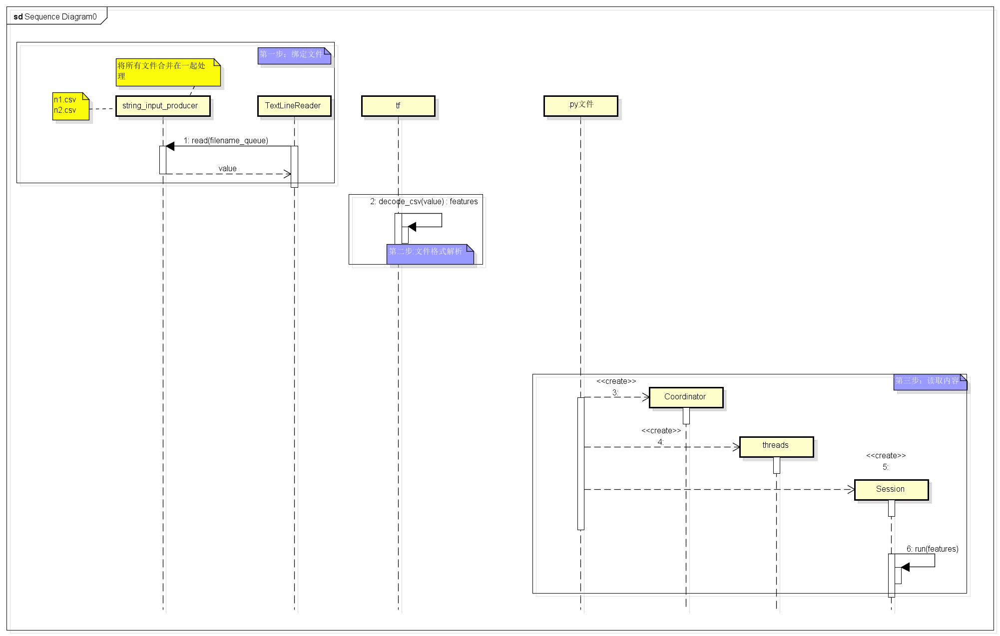

# 读取数据 
> 以读取csv文件(可以用excel进行转换 可以作为普通文本打开)为例  如果是普通文件 可以直接用python的接口读取

- ## 绑定文件
>  将文件放在队列中 创建reader 绑定到队列中 进行操作
> 关键类 TextLineReader
``` python
filename_queue = tf.train.string_input_producer(["n1.csv", "n2.csv"])#将文件扔进管道里面
reader = tf.TextLineReader()
key, value = reader.read(filename_queue)#读取文件的 ,
print("key=",key)# 打印 key= Tensor("ReaderReadV2:0", shape=(), dtype=string)
print("value=",value)#value= Tensor("ReaderReadV2:1", shape=(), dtype=string)
```

- ## 特殊格式解析 
> 这一步 主要是根据文件格式 选择对应的解析器 对文件进行解析 并根据内容进行特殊处理
> 关键词  tf.decode_csv
```
record_defaults = [[1], [1], [1], [1], [1]]
col1, col2, col3, col4, col5 = tf.decode_csv(
    value, record_defaults=record_defaults)# 进行解析
print("c1-5=",col1," ",col2," ",col3," ",col4," ",col5)
features = tf.stack([col1, col2, col3, col4])
print("f=",features)
```

- ## 读取内容 
> 终于到了最关键的一步 前面都是准备工作 ，这才是真正的数据读取 用法也很简单   
> 关键字:coordinater,线程 不懂的请参照[队列和线程](https://github.com/TFStudents/Tensorflow/tree/master/BaseLearn/threads)
```
with tf.Session() as sess:
  # Start populating the filename queue.
  coord = tf.train.Coordinator()
  threads = tf.train.start_queue_runners(coord=coord)
  for i in range(5):
    # Retrieve a single instance:
    example, label = sess.run([features, col5])
    print(example)
    print(label)
  coord.request_stop()
  coord.join(threads)
```

## 资源
[参考地址](https://www.tensorflow.org/programmers_guide/reading_data)   
[n1.csv](n1.csv)   
[n2.csv](n2.csv)   
[本实例代码](read_data.py) 

