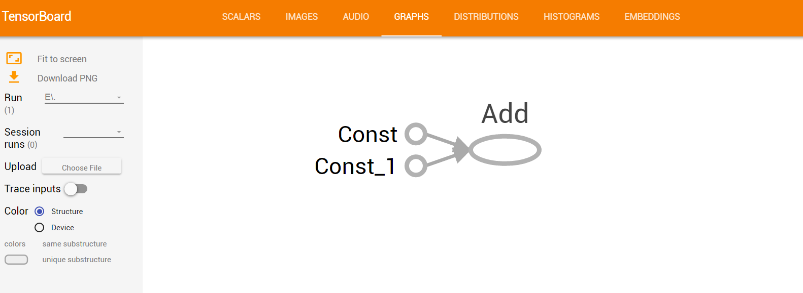

[源码TensorBoard.py](./TensorBoard.py)
# 如何使用TensorBoard
>说明：tensorBoard是Tensorflow的可视化工具
# 使用方法
1. 构建图并保存到文件
```python
import tensorflow as tf
node1=tf.constant(2,tf.float32)#定义节点，值为2
node2=tf.constant(3,tf.float32)#定义节点，值为3
node=tf.add(node1,node2)
print(node1)
with tf.Session() as sess:
    print(sess.run(node))
    tf.summary.merge_all
    tf.global_variables_initializer().run()
    writer = tf.summary.FileWriter("test_1", sess.graph)

```
[生成文件](./test_1)
2. 显示
> 利用1生成的文件，将视图关系显示出来，在命令行中输入
```
tensorboard --logdir="./test_1" #这是文件的路径
```

3. 在浏览器中打开
>  在浏览器中输入：http://192.168.56.1:6006 ，这是自己的电脑IP：6006是端口号    
- 而且在步骤2中有提示信息

- 效果图

