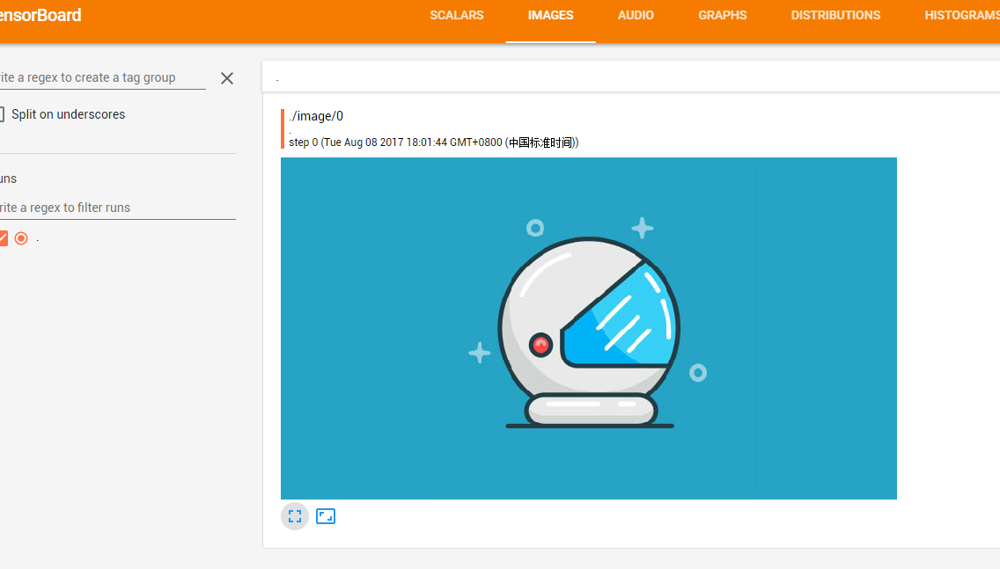

# Tensorboard显示图片
基本使用我们会了，那现在来看看怎么使用图片吧。     
[实例代码](./SummaryImage.py)   
完全不会用-[请点击这里](../tensorboard)   
      
### 1. 读取图片

```python 
    image_filename = "start_person.jpg"# 图片地址，这里是放在当前文件夹的
    # 获取图片数据
    file = open(image_filename, 'rb')
    data = file.read()
    file.close()
    # ---
    file_img = tf.image.decode_jpeg(data,channels=4)  
    file_img=tf.expand_dims(file_img,0)
    with tf.Session() as sess:
        init_op = tf.global_variables_initializer()
        sess.run(init_op)
        write = tf.summary.FileWriter("./test_2", graph=sess.graph)
        img = tf.summary.image("./", tensor=file_img)
        img_string = sess.run(img)
        write.add_summary(img_string)
```
### 2. 解析图片
解析图片，并转换为Tensor,这一步很关键，注意这里加一维
```python 
 file_img = tf.image.decode_jpeg(data,channels=3)  #Tensor("DecodeJpeg:0", shape=(?, ?, 3), dtype=uint8)
 file_img=tf.expand_dims(file_img,0)# Tensor("ExpandDims:0", shape=(1, ?, ?, 3), dtype=uint8)
```
### 3. 将图片写入文件
```python 
with tf.Session() as sess:
        init_op = tf.global_variables_initializer()
        sess.run(init_op)
        write = tf.summary.FileWriter("./test_2", graph=sess.graph)
        img = tf.summary.image("./", tensor=file_img)
        img_string = sess.run(img)
        write.add_summary(img_string)
```
[生成文件](./test_2)
### 4. 在Tensorboard中显示
在命令行，输入如下命令，在浏览器中输入类似[http://192.168.56.1:6006/]查看。[参考](../tensorboard)
```
tensorboard --logdir="./test_2"
```
### 5. 结果

